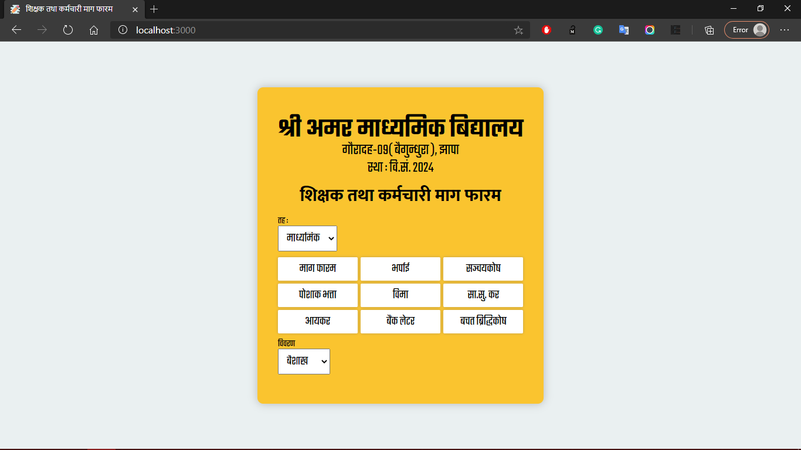
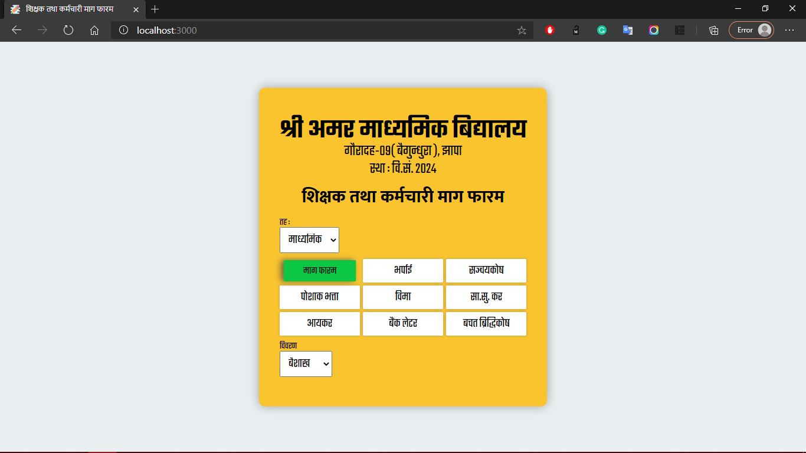
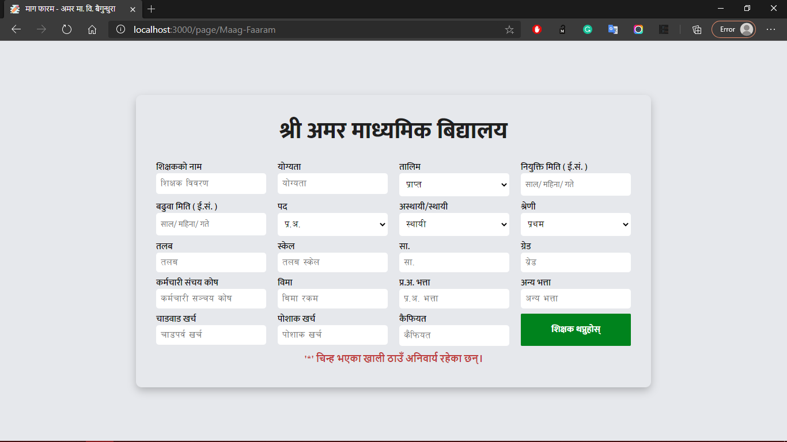
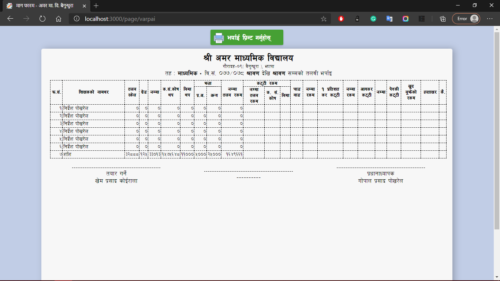
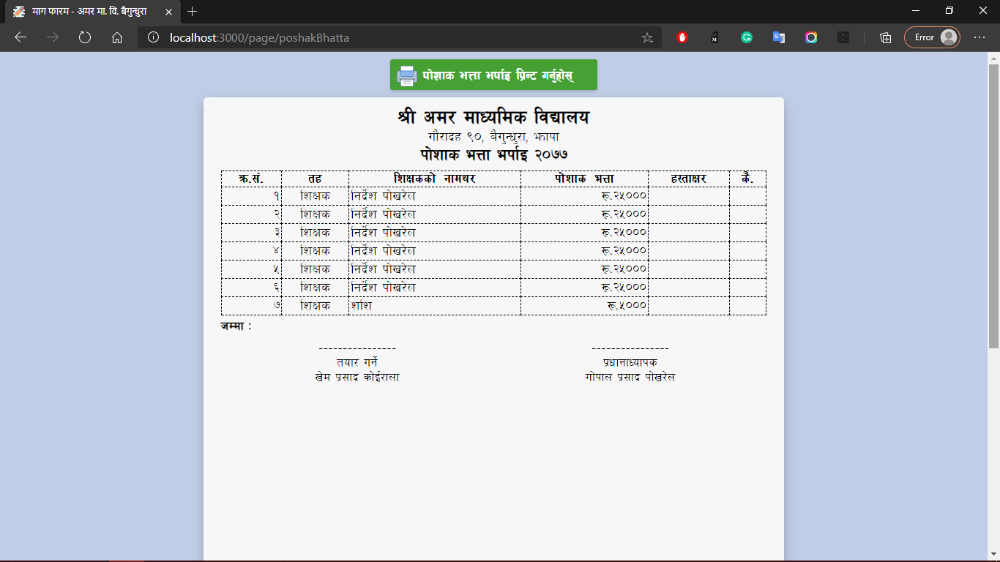
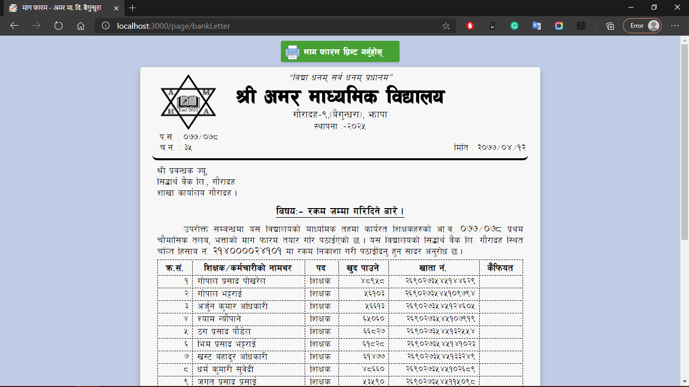

# Amar Software (INTERNAL)

## Start
1. To start the project, run the following commands
```JavaScript
npm start
```
*Make sure you are connected to the internet, Because it uses mongoDB Cloud Database.* Feel **free to contribute** to this project.
  - [ ] माग फारम
  - [x] [भर्पाई](#varpai-table)
  - [ ] संचयकोष
  - [x] [पोशाक भत्ता](#poshak-bhatta-table)
  - [ ] बिमा
  - [ ] सा.सु. कर
  - [ ] आयकर
  - [x] [बैंक लेटर](#bank-letter)
  - [ ] बचत वृद्धिकोष
## Front Panel
 
 ## Front Panel Hover View
 
 ## Teachers details entry Form
 
 ## Varpai Table
 
 ## Poshak Bhatta Table
 
 ## Bank Letter
 

 *Feel Free to contribute 😁 *